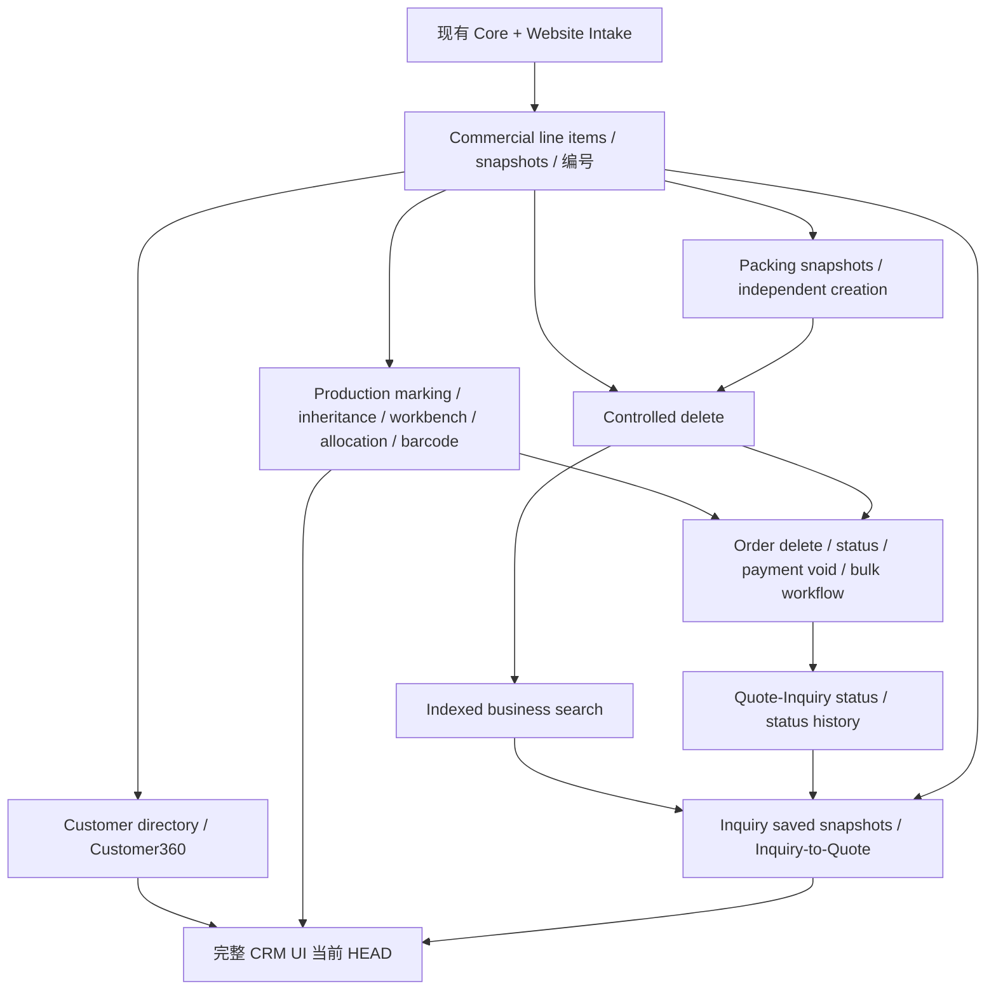

# ROMIKU CRM 2.0 Release Candidate

状态：本地候选版本，未推送/部署。Production rollout 仍需用户另行授权；本文件不授权任何远端操作。

## 范围结论：完整 CRM release

Production 基线 e4615195329b6da6d0bd4c2039c01199ecbde2bc；已验收 Preview 基线 9ce0b424ecea286da340a8324b565a64f5d82acc。两者之间145 commits /32 migrations。不是小型 Inquiry patch。完整历史提交见 rc/commit-inventory.txt；本次RC整理为其上的独立提交。

Inquiry API/schema 需要 independent saved items、commercial snapshots 和编号；最新 migration 同时扩展 controlled delete、business search、Quote 来源/转换、状态历史。当前整个前端还使用 Customer360、Production workbench/barcodes、financial/bulk workflow。单独 cherry-pick 最新 Inquiry commit 不能满足当前前端/RPC/schema。Customer360 与全部 Production changes 不都是 Inquiry ingestion 的直接依赖，但属于所发布 HEAD 的运行依赖。独立 Inquiry release 需要另建受限前端/数据库兼容包并重测，当前不推荐，也未实施。

图为发布依赖摘要；完整32项保守拓扑/前序/引入提交/hash见 [MIGRATIONS.md](rc/MIGRATIONS.md) 与 machine-readable JSON。不能按图省略 migration。19项保留有 Preview apply结果证据，13项需ledger复核；全部Production状态仍unknown。缺ledger记录不等于可以直接执行，必须与schema drift合并判断。

## 本次修复与边界

- 两个Vercel API及共享service-role客户端读取server SUPABASE_URL / SUPABASE_SERVICE_ROLE_KEY。目标guard固定环境白名单，错配/缺env拒绝，不用VITE推断server。仅白名单策略保留两个ref，无Preview默认连接地址。Edge Functions新增显式ROMIKU_DEPLOYMENT_ENV发布前置条件。
- 正式/QA分别调共享notification pipeline；QA-only SMTP allowlist/approved ID/capture/限时配置只在website-qa，正式包不包含它们。
- SMTP保持现有native PHP函数与config引用；只准备私有secret迁移和提取工具。正式运行包不含credential。SMTP未知接受结果暂停重试，需人工核对；不声称端到端exactly-once。
- 七类既有XLSX renderer/template未修改；只补充原PI/Order/Packing回归矩阵。
- 没有新业务功能或数据库migration。正式提交切换patch与offline ZIP已准备，但未安装。

## 本地测试与浏览器证据

- 全部supabase/tests SQL：本地既有基线+16份新schema在BEGIN/ROLLBACK内测试，987 assertions /19 plans，全通过；没有远端migration。可复跑 `python3 release/test-local-pgtap.py`，限定本地docker supabase_db_atomic-crm-demo。不是从空数据库重建，也不是Production兼容性证明。
- Vitest：149 files PASS，1053 tests PASS；2 opt-in local HTTP integration files与1个既有ContactList skeleton case跳过（共3 tests）。未把跳过项计为通过。
- 前端测试使用真实headless Chromium；server/API/functions/claude项目一并运行。
- PHP QA：125 checks；Node QA：5 tests；正式通知ledger PHP：7 checks；正式client Node：2 tests；read-only preflight Python：3 tests，均通过。
- typecheck / lint / build通过。既有ESLint ignore弃用、Vitest mock位置/旧browser import、Rollup循环chunk警告仍存在，没有宣称零warning。
- 七类XLSX：普通Quote、PI、Order、Production、Packing、Website Inquiry internal、website-source Quote，均覆盖1/5/20产品；保持template/renderer未变。
- Preview browser只读烟测：Quote/PI/Order/Production/Packing/WI/Outbound/Formal Customer/Customer360、Product Library、Calendar列表/详情正常；SUN5跨各单据命中并独立分组分页；Order多选工具栏；状态历史；受控删除预检拦截收款历史；Payment void原因必填、空值确认禁用、Cancel不提交。
- Browser本轮未实际执行删除/作废/状态写入。这些写路径由本地pgTAP与browser component tests覆盖；不把只读UI检查写作端到端写入验收。浏览器加载的是已验收9ce0b42 Preview，新增RC server/runtime未部署。
- 受控删除实际提示：该订单存在收款历史，不能永久删除。可以作废订单。

## 后续授权边界

Production上次审计为paused。本轮没有恢复、应用migration、部署、改Production secret/正式submit入口/旧CRM/Sanity。重新打开Production仪表盘被自动审批阻止（需用户下一阶段单独授权），所以没有重新验证实时paused状态。

本地candidate不是上线批准。下一步仅在用户明确“恢复Production Supabase并只读核验”后运行 preflight/production_readonly.py，获取实际ledger/schema/env验证结论。接着再单独批准部署和网站切换。

## Rollout与rollback checkpoint（将来，不执行）

A. Backup：保留下文记录的旧Vercel deployment；导出Production数据库完整备份/ledger/schema并验证可恢复；服务器私有目录备份app.js、HTML cache引用、submit-rfq.php、config、secret（0700/0600）。记录文件SHA、git SHA、环境变量scope；不得导出secret值到报告。
B. SMTP secret外迁：按SMTP-MOVE.md复制+校验+loader原子切换，验证既有SMTP行为后才移除公开目录副本。
C. CRM Production migrations：仅根据只读preflight确认的缺失清单和依赖顺序；每批记录ledger/差异，失败停止。不盲目重复32份migration。
D. Production deploy：明确使用现有romiku-crm-prod项目，先检查目标project ID。当前本地.vercel链接不是可信生产目标，禁止裸命令直接部署。预备deployment健康检查通过后才切alias。
E. Env校验：按ENV-PREFLIGHT.md验证server/frontend同Production ref，shared secret与Namecheap相等（只输出boolean）。
F. 正式endpoint切换：短暂停止新提交，备份原handler并提取SMTP，生成hash锁定app patch；安装私有release+持久ledger，frontend/helper/wrapper一并切换，cache版本更新。不双写，不fallback。
G. 一条授权真实Production Inquiry：首提交创建1WI、saved Request Qty附件、两封邮件各一次；相同UUID重试不重建/不重发。客户测试地址须用户指定。
H. 旧CRM不再写入：核对旧endpoint调用记录/旧CRM记录count，确保同submission没有旧写入；禁止为测试而POST旧endpoint。
I. Rollback checkpoint：以是否已经接受新CRM inquiry为分界。

准确旧Vercel deployment：`dpl_NUWQSgpYFz4eddFfHq5C2VtsJVZA`。旧Git SHA见本文开头。只在验证旧应用兼容已升级schema后，才可把alias恢复旧deployment；通常保留增量schema，不执行破坏性down migration。

**F之前失败**：正式网站仍指向旧CRM，无需改网站；停止新release。必要时恢复旧alias。SMTP私有化成功后无需跟应用回滚。

**F之后但无任何新CRM成功receipt**：暂停提交，确认持久ledger没有receipt且没有未知in-flight请求，原子恢复已备份handler/app.js/cache版本；复核只写旧CRM。没有确认前不能自动fallback。

**已有新CRM receipt/邮件成功或未知**：先将新入口enabled=false（503），保留所有state/accepted/attempting记录和新CRM数据，绝不清空ledger/重发/数据库整体倒回。逐UUID核对CRM+SMTP；有receipt的原UUID只在新链重试，不能转发旧CRM。未解决的submission保留暂停，不能简单恢复不识别UUID的旧handler。恢复旧网站接单必须在清空in-flight、完成接受记录与邮件对账后另行制定明确cutoff/重试隔离并经授权；否则保持维护状态。这是防重复与防丢单的安全回退。

数据库备份恢复只用于不可恢复的schema事故，需另行授权并评估上线后数据，不能用备份覆盖已经接收的真实Inquiry。所有rollback同样禁止双写。

## Freeze

提交本候选后不继续功能开发；仅允许deployment blocker/security/migration compatibility fix。任何修复生成新RC和对应回归记录。待用户审核后才进入下一阶段。

## 未提交改动处理

正式runtime与QA harness分别入本RC，测试fixture只含虚构credential。用户既有.gitignore修改、.vitest-attachments和output保存在独立本地stash，未进入RC提交或发布ZIP。为保持原secret忽略行为，.env*与.vercel仅追加到本机Git info/exclude，不提交.gitignore。/private/tmp中的日志、SMTP QA截图、邮件、ZIP不加入Git。
